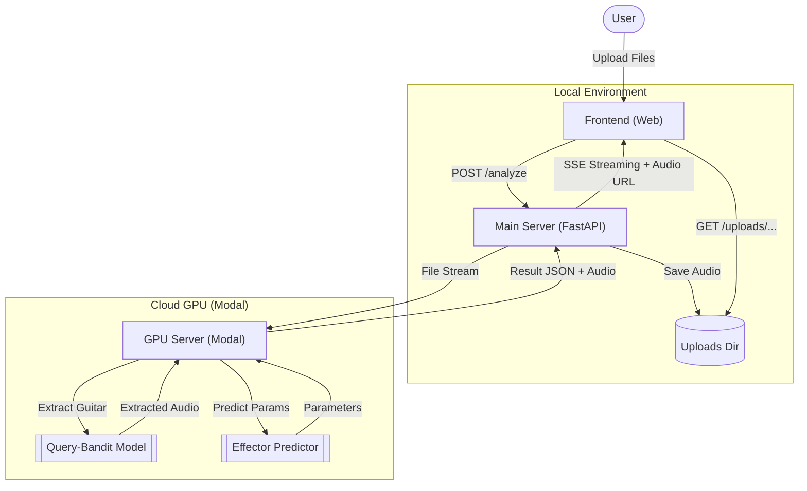

# 🎸 Boss Effector Analyzer

**Boss Effector**는 사용자가 업로드한 원곡에서 **기타(Guitar) 트랙을 AI로 추출**하고, 해당 기타 소리에 적용된 **이펙터(Effector)와 파라미터를 분석**해주는 웹 서비스입니다.


## ✨ 주요 기능 (Features)

1.  **AI 기반 기타 소리 추출 (Guitar Extraction)**
    *   **Query-Bandit** 모델을 활용하여 원곡과 기타 샘플(Query)을 기반으로 고품질의 기타 트랙을 분리합니다.
    *   GPU 가속(A10G)을 통해 빠른 처리 속도를 제공합니다.

2.  **이펙터 파라미터 예측 (Effector Prediction)**
    *   추출된 기타 소리를 분석하여 사용된 이펙터 종류(Overdrive, Distortion, Reverb 등)를 식별합니다.
    *   해당 이펙터의 주요 파라미터(Gain, Tone, Level 등) 추천 값을 제공합니다.

3.  **실시간 진행 상태 모니터링**
    *   Server-Sent Events (SSE)를 통해 분석 진행률을 실시간으로 사용자에게 보여줍니다.

4.  **결과 오디오 즉시 재생**
    *   분석이 완료되면 추출된 기타 사운드를 웹에서 바로 들어보고 다운로드할 수 있습니다.

## 🛠️ 시스템 아키텍처 (Architecture)



### 컴포넌트별 역할

1.  **Main Server (`main.py`)**
    *   **역할**: 클라이언트 요청 처리, 파일 업로드 관리, 결과 스트리밍, 정적 파일 서빙.
    *   **기술**: Python FastAPI, httpx, aiofiles.
    *   **동작**: 사용자의 파일을 받아 GPU 서버로 전달하고, 결과를 받아 프론트엔드로 중계하며 추출된 오디오 파일을 로컬에 저장하여 제공합니다.

2.  **GPU Server (`gpu-server/app.py`)**
    *   **역할**: 고성능 AI 모델 추론 (기타 추출 및 이펙터 분석).
    *   **기술**: Modal (Serverless GPU), PyTorch, Query-Bandit.
    *   **특징**: A10G GPU를 사용하여 무거운 연산을 처리하며, 필요할 때만 실행되는 Serverless 구조입니다.

3.  **Frontend (`frontend/`)**
    *   **역할**: 사용자 인터페이스 제공 및 오디오 재생.
    *   **기술**: HTML5, CSS3, Vanilla JavaScript.

## 🚀 설치 및 실행 방법 (Getting Started)

### 1. 사전 요구 사항 (Prerequisites)
*   Python 3.10 이상
*   [Modal](https://modal.com/) 계정 및 CLI 설정 (`pip install modal` -> `modal setup`)

### 2. 프로젝트 클론
```bash
git clone https://github.com/your-username/boss-effector.git
cd boss-effector
```

### 3. 환경 변수 설정
프로젝트 루트에 `.env` 파일을 생성하고 GPU 서버 URL을 설정해야 합니다. (GPU 서버 배포 후 생성된 URL 입력)

```env
# .env 예시
GPU_SERVER_URL=https://your-modal-app-url.modal.run
```

### 4. GPU 서버 실행 (Modal)
먼저 GPU 서버를 실행하여 URL을 확보합니다.

```bash
# 개발 모드 (터미널이 열려있는 동안만 실행)
modal serve gpu-server/app.py

# 또는 영구 배포
# modal deploy gpu-server/app.py
```
*실행 후 출력되는 URL을 복사하여 `.env` 파일에 입력하세요.*

### 5. 메인 서버 실행 (Local)
필요한 패키지를 설치하고 서버를 시작합니다.

```bash
# 가상환경 생성 및 활성화 (권장)
python -m venv .venv
source .venv/bin/activate  # Windows: .venv\Scripts\activate

# 패키지 설치
pip install -r requirements.txt

# 서버 실행
python main.py
```

### 6. 서비스 접속
웹 브라우저에서 `frontend/index.html` 파일을 열거나, 로컬 웹 서버를 통해 접속합니다.
(VS Code의 'Live Server' 확장 사용 권장)

## 📂 폴더 구조 (Folder Structure)

```
boss-effector/
├── main.py                     # 메인 FastAPI 서버 (Local Orchestrator)
├── requirements.txt            # 메인 서버 의존성
├── .env                        # 환경 변수 (GPU 서버 URL 등)
├── frontend/                   # 웹 프론트엔드
│   ├── index.html
│   ├── script.js
│   └── style.css
│
├── gpu-server/                 # GPU 처리 서버 (Modal)
│   ├── app.py                  # Modal 앱 정의 및 FastAPI
│   └── requirements-gpu.txt    # (참고용) GPU 서버 의존성
│
├── uploads/                    # 임시 업로드 폴더 (자동 생성)
└── README.md
```

## 📝 API Reference

| Method | Endpoint | Description |
| :--- | :--- | :--- |
| `POST` | `/analyze` | 오디오 파일(원곡, 샘플)을 업로드하고 분석을 시작합니다. (SSE 스트리밍) |
| `GET` | `/health` | 메인 서버 및 GPU 서버의 연결 상태를 확인합니다. |
| `GET` | `/uploads/{filename}` | 추출된 오디오 파일을 다운로드/재생합니다. |

## ⚠️ 주의 사항
*   **GPU 서버 초기화**: Modal 컨테이너가 처음 실행될 때(`Cold Start`) 모델 가중치를 로드하느라 약 1~2분 정도 소요될 수 있습니다.
*   **파일 관리**: `uploads/` 폴더에 저장된 파일은 자동으로 삭제되지 않으므로, 주기적인 정리가 필요할 수 있습니다.

## ⚓️ License
MIT License
